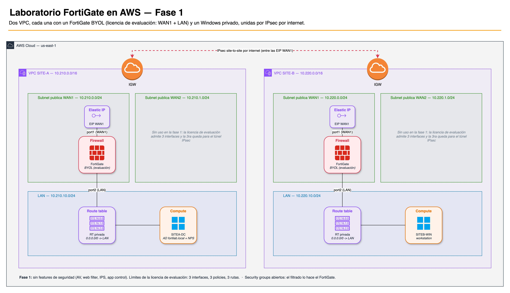
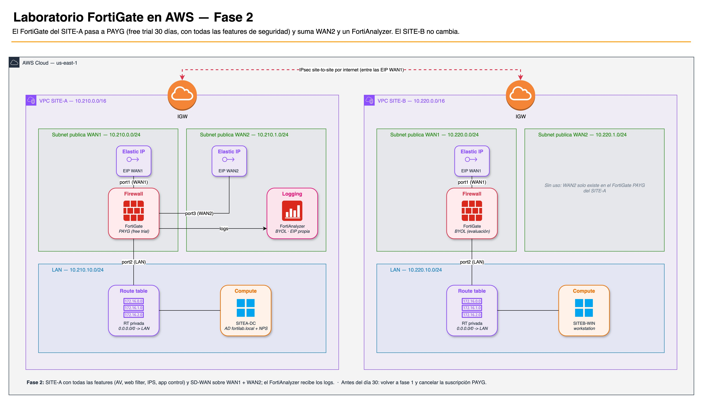

# Laboratorio FortiGate en AWS

Laboratorio para el **curso de FortiGate** (basado en la *FortiOS 8.0
Administrator Study Guide*). Con unos pocos comandos arma, **en tu propia cuenta
de AWS**, dos "sitios" de una empresa, cada uno protegido por un **FortiGate** y
con una **PC Windows** detrás, para que practiques todo lo que ves en el curso.

**No necesitás saber AWS.** Todo se hace desde el navegador (con **AWS
CloudShell**, una terminal que AWS te da dentro de su consola) siguiendo esta
guía **en orden**. No hace falta instalar nada en tu computadora.

> El lab está pensado para que **no pagues nada de tu bolsillo**: todo lo cubren
> los créditos gratuitos que AWS da a las cuentas nuevas. Para eso es importante
> seguir los pasos de costos (alertas y apagado) tal cual están.

---

## Índice

1. [Glosario mínimo](#glosario-mínimo)
2. [Antes de empezar (una sola vez)](#antes-de-empezar-una-sola-vez)
3. [Desplegar el lab (fase 1)](#desplegar-el-lab-fase-1)
4. [Uso diario](#uso-diario)
5. [Fase 2: features de seguridad (30 días)](#fase-2-features-de-seguridad-30-días)
6. [Al terminar el curso](#al-terminar-el-curso)
7. [Problemas frecuentes](#problemas-frecuentes)
8. [Referencia técnica](#referencia-técnica)

---

## Glosario mínimo

| Término | Qué es, en criollo |
|---------|--------------------|
| **Consola de AWS** | La página web de AWS donde manejás tu cuenta: <https://console.aws.amazon.com>. |
| **Región** | En qué país/datacenter de AWS se crea todo. Este lab usa **N. Virginia (`us-east-1`)**. Se elige arriba a la derecha en la consola. |
| **CloudShell** | Una terminal (línea de comandos) dentro de la consola de AWS. Desde ahí corrés los comandos de esta guía. |
| **Instancia** | Una máquina virtual en AWS. El lab crea varias: FortiGates y Windows. Se **prenden y apagan** como una PC; apagadas no gastan cómputo. |
| **Créditos** | Saldo gratuito que AWS da a las cuentas nuevas (hasta US$ 200). El lab se paga con eso. |
| **Budget** | Una alerta de costos de AWS que te avisa por email. |
| **Marketplace** | La "tienda" de AWS. Para usar FortiGate en AWS hay que "suscribirse" una vez al producto (es gratis suscribirse). |
| **BYOL / PAYG** | Dos formas de licenciar FortiGate. **BYOL** = licencia de evaluación gratuita de Fortinet (sin las features de seguridad). **PAYG** = licencia por hora vía AWS, con todas las features; tiene **30 días de prueba gratis**. |
| **FortiCare** | Tu cuenta en el portal de Fortinet (<https://support.fortinet.com>). Con ella se activa la licencia de evaluación del FortiGate. |
| **IP pública** | La dirección por la que entrás al FortiGate desde internet (ej. `https://54.152.184.15`). |
| **Instance-id** | El identificador de una instancia (ej. `i-0472e7952cac1b1e1`). En el FortiGate es la **contraseña inicial**. |
| **SITE-A / SITE-B** | Los dos sitios del lab. Cada uno es una red aislada (en AWS se llama **VPC**) con su FortiGate y su Windows. |
| **DC (domain controller)** | El Windows del SITE-A es un servidor de **Active Directory** (dominio `fortilab.local`), para las clases de autenticación. |
| **Fleet Manager** | Herramienta de la consola de AWS para abrir el escritorio del Windows en el navegador. |

---

## Antes de empezar (una sola vez)

### Paso 1 — Crear la cuenta de AWS en "Paid plan"

1. Registrate en <https://aws.amazon.com> (pide tarjeta, pero con los créditos
   no se cobra nada).
2. Cuando te pregunte el plan, elegí **Paid plan** (NO "Free plan"):
   - Los **créditos los recibís igual** (US$ 100 al registrarte + hasta US$ 100
     más por actividades). No perdés nada por elegir Paid.
   - El **Free plan bloquea** las máquinas que usa el lab y el despliegue falla.
   - En Paid plan **no te cobran nada mientras te alcancen los créditos**.
3. **¿Ya la creaste en Free plan?** Cambiala desde la consola: **Billing and
   Cost Management** → cambiar de plan → **Paid plan**. Los créditos se
   conservan. Hacelo **desde Billing**; nunca uniendo la cuenta a una "AWS
   Organization", porque eso **anula los créditos**.

### Paso 2 — Elegir la región y abrir CloudShell

1. Entrá a la consola de AWS: <https://console.aws.amazon.com>.
2. Arriba a la derecha, elegí la región **N. Virginia (`us-east-1`)**. Usá
   siempre esta región en todo el curso.
3. Abrí **CloudShell**: es el ícono de terminal (`>_`) en la barra de arriba (o
   buscá "CloudShell" en el buscador de la consola). Tarda un minuto la primera
   vez.

Todos los comandos de esta guía se **copian y pegan en CloudShell** y se
ejecutan con Enter.

### Paso 3 — Descargar el lab

En CloudShell:

```bash
git clone https://github.com/eanselmi/fgt-lab.git fgt-lab
cd fgt-lab
```

> Cada vez que abras CloudShell en otro momento, entrá a la carpeta con
> `cd fgt-lab` antes de correr los comandos.

### Paso 4 — Ganar los créditos extra (opcional, recomendado)

Las cuentas nuevas pueden ganar **US$ 100 más** completando 5 tareas simples. El
lab trae un script que las hace solo:

```bash
./tasks deploy
```

Los créditos pueden tardar un rato en aparecer (los ves en la consola, en
**Billing and Cost Management → Credits**). **Cuando aparezcan**, borrá lo que
creó el script para no gastar de más:

```bash
./tasks destroy
```

> Si la tarea de **Bedrock** no se acredita, hacela a mano (1 minuto): consola →
> buscá **Amazon Bedrock** → **Playground** (chat) → elegí un modelo → mandá
> cualquier mensaje.

### Paso 5 — Activar las alertas de costos (obligatorio)

```bash
./lab.sh budget deploy
```

Te pide tu **email**. Crea dos alertas que te avisan por correo:

- si aparece **gasto real de tu bolsillo** (más de US$ 0,50 en el mes), y
- cuando te quedan **menos de US$ 10 de créditos**.

**Importante:** te va a llegar un email de **AWS Notifications**. Abrilo y hacé
clic en **Confirm subscription**; si no, **no te llegan los avisos**.

Este paso se hace **una sola vez**: las alertas siguen activas aunque borres y
vuelvas a crear el lab muchas veces.

### Paso 6 — Suscribirte al FortiGate en Marketplace

1. En la consola de AWS, buscá **AWS Marketplace** → **Discover products**.
2. Buscá **FortiGate BYOL** y abrí el producto de **Fortinet** cuyo nombre
   dice **BYOL** (*Bring Your Own License*). Ojo: no el que dice "Free trial" /
   PAYG, ese es para la fase 2.
3. **View purchase options** → **Subscribe** (o **Accept terms**). Suscribirse
   es gratis.

Si te salteás este paso, el despliegue falla con el error `OptInRequired`.

> El producto **PAYG** y el **FortiAnalyzer** se suscriben recién en la
> [fase 2](#fase-2-features-de-seguridad-30-días), **no antes**.

### Paso 7 — Crear dos cuentas FortiCare

Cada FortiGate del lab usa una **licencia de evaluación gratuita**, y cada
cuenta de Fortinet admite **una sola**. Necesitás **dos cuentas** (una por
FortiGate):

1. Registrate en <https://support.fortinet.com> (**Register**) con un email.
2. Repetí con **otro email** para la segunda cuenta.

Anotá cuál vas a usar para el FortiGate del **SITE-A** y cuál para el del
**SITE-B**.

---

## Desplegar el lab (fase 1)



```bash
./lab.sh deploy
```

El script te hace dos preguntas para el **apagado automático diario** (cuida
tus créditos si te olvidás las máquinas prendidas):

1. **A qué hora** apagar todo (solo la hora, `0`–`23`). Elegí una hora en la
   que seguro no estés practicando, por ejemplo `4` (las 4 de la mañana).
2. Tu **zona horaria**: elegí el número de tu país (si no está, opción `11`; ver
   [Problemas frecuentes](#problemas-frecuentes)).

El despliegue tarda unos **5–10 minutos**. Cuando termina:

- Esperá **unos 15 minutos más**: el Windows del SITE-A se configura solo como
  servidor de Active Directory y se reinicia 2 veces.
- Para ver los datos de acceso (IPs y contraseñas iniciales) corré:

```bash
./lab.sh status
```

> Las máquinas quedan **prendidas** después del deploy. Si no vas a practicar
> ahora, **apagalas** cuando pasen esos 15 minutos (ver [Uso diario](#uso-diario)).

---

## Uso diario

### Ver el estado del lab

```bash
./lab.sh status
```

Muestra, sin cambiar nada: qué máquinas están prendidas o apagadas, las **IPs
públicas** de los FortiGate, los **instance-id** (contraseñas iniciales), si los
Windows están accesibles y cuántos créditos consumiste.

### Prender y apagar las máquinas

Desde la consola de AWS:

1. Buscá **EC2** → **Instances** (instancias).
2. Seleccioná las máquinas (`SITE-A-fgt`, `SITE-A-win`, `SITE-B-fgt`,
   `SITE-B-win`).
3. **Instance state** → **Start instance** (prender) o **Stop instance**
   (apagar).

Consejos:

- **Prendé primero el FortiGate** y después el Windows de ese sitio.
- Prendé solo el sitio que vas a usar (por ejemplo, solo SITE-A).
- **Apagalas al terminar de practicar.** Igual, todos los días a la hora que
  elegiste se apagan solas.

> ⚠️ **Al apagar o prender, la IP pública del FortiGate NO cambia** (es fija).

### Entrar al FortiGate

1. Buscá la IP en `./lab.sh status` (línea `SITE-A-fgt-wan1` o
   `SITE-B-fgt-wan1`) y abrí en el navegador `https://<esa-IP>`.
2. El navegador va a avisar que **la conexión no es privada / certificado no
   válido**. Es normal (el FortiGate usa un certificado propio): elegí
   **Avanzado → Continuar al sitio**.
3. Usuario: `admin` — Contraseña inicial: el **instance-id** del FortiGate
   (columna `INSTANCE-ID` de `./lab.sh status`, ej. `i-0472e7952cac1b1e1`).
4. El FortiGate te pide **cambiar la contraseña** y **activar la licencia** con
   tu **cuenta FortiCare** (la del SITE-A para el FortiGate del SITE-A, la otra
   para el SITE-B). Al licenciarse puede reiniciarse solo: esperá un par de
   minutos y volvé a entrar.

> El FortiGate queda accesible desde internet. Una de las primeras tareas del
> curso es **asegurar el acceso de administración**: hacela apenas puedas.

### Entrar al Windows

El Windows no tiene IP pública: se entra por **Fleet Manager**, que abre su
escritorio en el navegador.

> ⚠️ **Funciona recién después de configurar en el FortiGate la salida a
> internet (policy con NAT)**, que es uno de los primeros labs del curso. El
> Windows se conecta a AWS **a través del FortiGate**; hasta entonces, Fleet
> Manager no lo ve. `./lab.sh status` te muestra si ya está accesible.

1. En la consola, buscá **Systems Manager** → **Fleet Manager**.
2. Seleccioná el Windows (por su instance-id, ver `./lab.sh status`).
3. **Node actions** → **Connect** → **Connect with Remote Desktop**.
4. Elegí **User credentials**:
   - Usuario: `Administrator` (en el DC del SITE-A también vale
     `FORTILAB\Administrator`, que es el administrador del dominio)
   - Contraseña: `Fortinet1!`

### Si vas a dejar de practicar un tiempo

Aunque estén **apagadas**, AWS cobra (de tus créditos) los **discos** y las
**IPs públicas**: unos **US$ 20 por mes** en fase 1. Si vas a dejar el curso
**más de una o dos semanas**, borrá el lab y volvé a crearlo al retomar:

```bash
./lab.sh destroy     # borra el lab (las alertas de costos siguen activas)
# ... cuando retomes:
./lab.sh deploy
```

Al recrearlo **se pierde la configuración** de los FortiGate (hacé un backup
antes, ver [fase 2](#fase-2-features-de-seguridad-30-días)) y hay que **volver a
licenciarlos**: en cada cuenta FortiCare, primero **desasociá** el FortiGate
viejo.

---

## Fase 2: features de seguridad (30 días)



En la fase 1 los FortiGate usan la licencia de evaluación, que **no incluye**
antivirus, filtro web, IPS ni control de aplicaciones, y permite como máximo 3
interfaces, 3 policies y 3 rutas. En la fase 2 el FortiGate del **SITE-A** pasa a
**PAYG**, con todas las features, durante la **prueba gratuita de 30 días**.
Además se agrega un **FortiAnalyzer** (para logs) y una segunda salida a
internet (**WAN2**, para SD-WAN). El SITE-B no cambia.

> ⚠️ **Leé esto antes de empezar:**
> - La prueba es de **30 días** y **cubre una sola máquina**.
> - Al día 30 **se convierte sola en pago**, y ese pago **NO lo cubren los
>   créditos**: sale de tu tarjeta (unos US$ 0,88 por hora). **Agendá un
>   recordatorio** para terminar la fase 2 antes del día 30.
> - Hacela **después** de completar los labs de la fase 1.

### Empezar la fase 2

1. **Backup de la configuración del FortiGate del SITE-A:** en su GUI, menú del
   usuario `admin` (arriba a la derecha) → **Configuration** → **Backup**.
   Guardá el archivo en tu computadora.
2. **Suscribite en Marketplace** (igual que en el
   [paso 6](#paso-6--suscribirte-al-fortigate-en-marketplace)) a:
   - **Fortinet FortiGate Next-Generation Firewall** (el **PAYG**, con
     "Free trial"; producto
     <https://aws.amazon.com/marketplace/pp/prodview-wory773oau6wq>).
   - **FortiAnalyzer** (el **BYOL**).
3. Desplegá la fase 2 (te pide confirmar escribiendo `si`):

   ```bash
   ./lab.sh deploy fase2
   ```

4. El FortiGate del SITE-A es una **máquina nueva** (nueva contraseña inicial:
   su nuevo instance-id en `./lab.sh status`). Su **IP pública WAN1 no
   cambia**. Entrá y **restaurá el backup**: menú `admin` → **Configuration** →
   **Restore**.
5. El **FortiAnalyzer** aparece en `./lab.sh status`: entrá a `https://<su-IP>`
   con usuario `admin` y su instance-id como contraseña, y activá su licencia de
   prueba con tu cuenta FortiCare.

### Terminar la fase 2 (antes del día 30)

1. Volvé a la fase 1 (borra el FortiGate PAYG y el FortiAnalyzer y recrea el
   FortiGate BYOL del SITE-A):

   ```bash
   ./lab.sh deploy fase1
   ```

2. **Cancelá la suscripción PAYG:** consola → **AWS Marketplace** → **Manage
   subscriptions** → el FortiGate PAYG → **Actions** → **Cancel subscription**.
3. Volvé a licenciar el FortiGate del SITE-A con su cuenta FortiCare
   (desasociando antes el anterior) y **restaurá el backup que hiciste antes de
   empezar la fase 2** (el de la licencia BYOL: el de la fase 2 incluye `port3`,
   que en BYOL no existe).

---

## Al terminar el curso

```bash
./lab.sh destroy          # 1) borra el lab
./lab.sh budget destroy   # 2) borra las alertas de costos
```

Si llegaste a la fase 2, verificá que la suscripción PAYG esté **cancelada**
(ver arriba).

---

## Problemas frecuentes

| Problema | Solución |
|----------|----------|
| El deploy falla con `OptInRequired` | Falta suscribirte al producto en Marketplace ([paso 6](#paso-6--suscribirte-al-fortigate-en-marketplace); en fase 2, también PAYG y FortiAnalyzer). |
| El deploy falla con `not eligible for Free Tier` | Tu cuenta está en **Free plan**: pasala a **Paid plan** ([paso 1](#paso-1--crear-la-cuenta-de-aws-en-paid-plan)). |
| `./lab.sh: No such file or directory` | No estás en la carpeta del lab: corré `cd fgt-lab`. |
| El navegador dice "la conexión no es privada" al entrar al FortiGate | Es normal: **Avanzado → Continuar al sitio**. |
| No puedo entrar al FortiGate | ¿Está prendido? Mirá `./lab.sh status`. La contraseña inicial es el **instance-id** (empieza con `i-`). |
| Fleet Manager no muestra el Windows | Falta la **policy con NAT** en el FortiGate de ese sitio, o el Windows/FortiGate está apagado. |
| No me llegan los emails de alertas | Buscá el email de **AWS Notifications** (también en spam) y hacé clic en **Confirm subscription**. |
| Mi país no está en la lista de zonas horarias | Opción `11` y escribí tu zona de la columna **"TZ identifier"** de [esta tabla](https://en.wikipedia.org/wiki/List_of_tz_database_time_zones) (ej. `Europe/Lisbon`). |
| No puedo licenciar el FortiGate con mi cuenta FortiCare | Esa cuenta ya tiene un FortiGate asociado (de un deploy anterior): **desasocialo** en el portal de FortiCare y volvé a intentar. |
| Se me apagaron las máquinas mientras practicaba | Llegó la hora del apagado automático: prendelas de nuevo. |
| CloudShell se cerró / es una sesión nueva | Normal. Volvé a entrar con `cd fgt-lab`. El script vuelve a descargar lo que necesita (~30 segundos). |

---

## Referencia técnica

Esta sección es para quien quiera saber qué crea el lab por dentro. No hace falta
para usarlo.

### Comandos

| Comando | Qué hace |
|---------|----------|
| `./lab.sh budget deploy`         | **Primero, una sola vez.** Crea las alertas de costos por email. Es un despliegue independiente: no lo afectan los `deploy`/`destroy` del lab. |
| `./lab.sh budget destroy`        | Al terminar el curso: elimina las alertas y su bucket de state. |
| `./lab.sh budget plan`           | Muestra qué crearía/cambiaría `budget deploy`, sin aplicar. |
| `./lab.sh deploy [fase1\|fase2]` | Despliega el lab. `fase1` (default) = ambos FortiGate BYOL; `fase2` = FortiGate del SITE-A en PAYG + WAN2 + FortiAnalyzer. |
| `./lab.sh plan [fase1\|fase2]`   | Muestra qué se va a crear/cambiar, sin aplicar. |
| `./lab.sh destroy`               | Destruye todo el lab y borra su bucket de state. **No toca el budget.** |
| `./lab.sh status`                | Estado del lab sin cambiar nada: instancias (prendida/apagada, status checks, versión de FortiOS), IPs públicas, Windows conectados a SSM (y si el DC ya está en el dominio) y créditos consumidos. No necesita Terraform. |

### Topología

Dos sitios (VPCs), sin solaparse para permitir el túnel IPsec entre ellos. Todas
las subnets de un sitio van en la **misma zona de disponibilidad (AZ)**:

| Sitio  | VPC CIDR        | WAN1 (pública)  | WAN2 (pública)  | LAN (privada)    |
|--------|-----------------|-----------------|-----------------|------------------|
| SITE-A | `10.210.0.0/16` | `10.210.0.0/24` | `10.210.1.0/24` | `10.210.10.0/24` |
| SITE-B | `10.220.0.0/16` | `10.220.0.0/24` | `10.220.1.0/24` | `10.220.10.0/24` |

Puertos del FortiGate (iguales en todas las fases, así un backup/restore entre
BYOL y PAYG no cambia los nombres de interfaz):

| Puerto | Rol  | Subnet | IP pública | Cuándo |
|--------|------|--------|------------|--------|
| `port1` | WAN1 | pública 1 | Elastic IP (fija) | Siempre |
| `port2` | LAN  | privada   | —          | Siempre (gateway del Windows) |
| `port3` | WAN2 | pública 2 | Elastic IP (fija) | Solo el FortiGate PAYG (fase 2), para SD-WAN/ECMP |

- La licencia de evaluación BYOL admite **3 interfaces, 3 policies y 3 rutas**:
  por eso en BYOL el FortiGate tiene solo 2 puertos y queda **una interfaz libre
  para el túnel IPsec**.
- **Windows Server 2022** en la LAN, sin IP pública:
  - **SITE-A:** `SITEA-DC`, domain controller de `fortilab.local` (NetBIOS
    `FORTILAB`) con DNS y NPS (RADIUS), para Firewall Authentication y FSSO.
  - **SITE-B:** `SITEB-WIN`, workstation.
- La route table privada manda `0.0.0.0/0` a la interfaz LAN del FortiGate.
- **Security groups abiertos** (todo el tráfico): el filtrado lo hace el
  FortiGate, no AWS. VIP, DNAT, IPsec y administración funcionan sin tocar AWS.
- **Fase 2:** un **FortiAnalyzer** en la subnet WAN1 del SITE-A, con su propia
  Elastic IP. Licencia trial: hasta 3 dispositivos y 1 GB/día de logs. El
  FortiGate del SITE-A le manda logs por IP privada; el del SITE-B, por IP
  pública.
- Discos **gp3**. FortiOS y FortiAnalyzer fijados en **8.0.1** para que todo el
  curso use la misma GUI.

### Fases y lecciones del curso

| Fase | Qué hay | Lecciones |
|------|---------|-----------|
| `fase1` | 2 FortiGate **BYOL** (WAN1 + LAN), DC en SITE-A | 01, 03, 04 (estático), 05, 06, 07 (conceptos), 11 (básico), 14, 15 |
| `fase2` | FortiGate del SITE-A en **PAYG** (+WAN2) + **FortiAnalyzer**; SITE-B sigue BYOL | 02, 04 (ECMP), 07 (SSL inspection), 08, 09, 10, 11 (redundante\*), 12 |
| HA (próximamente) | 2 FortiGate BYOL en cluster | 13 |

\* **VPN redundante: a validar.** El FortiGate del SITE-B (BYOL) no tiene
interfaces para 2 túneles; la idea es que actúe como servidor **dial-up** (una
sola interfaz de túnel que recibe los 2 túneles de WAN1 y WAN2 del SITE-A). Si no
entra en los límites de la licencia eval, este lab queda como teoría.

### Alertas de costos (budget)

- **Budget de gasto de bolsillo:** US$ 1 por mes, avisa al 50% y al 100%. Mide el
  gasto **después** de aplicar créditos (debería ser siempre 0; el fee de
  FortiOS PAYG pasado el trial **no** lo cubren los créditos).
- **Budget de créditos:** avisa cuando quedan **menos de US$ 10** de US$ 200
  (`credit_total`; si tu cuenta tiene otro monto, ajustá esa variable). Mide el
  gasto **antes** de créditos, desde el **primer mes con consumo de la cuenta**
  (≈ apertura de la cuenta; lo detecta `budget deploy` con Cost Explorer, US$
  0,01 por consulta). El saldo exacto está en **Billing → Credits**.
- Para cambiar el email, volvé a correr `./lab.sh budget deploy`.

### Apagado automático

Cada `deploy` programa (con EventBridge Scheduler) un apagado diario de todas
las instancias del lab a la hora elegida. Solo apaga, nunca prende.

### State (dónde se guarda)

Dos despliegues de Terraform independientes, cada uno con su bucket S3 de state
(lock nativo de S3, acceso público bloqueado), que el script crea en su `deploy`
y elimina en su `destroy`:

| Despliegue | Directorio | Bucket de state |
|------------|------------|-----------------|
| Lab (`./lab.sh deploy/destroy`) | `aws/` | `fgt-lab-<ACCOUNT-ID>` |
| Budget (`./lab.sh budget deploy/destroy`) | `budget/` | `fgt-lab-budget-<ACCOUNT-ID>` |

### Notas

- Terraform (v1.15.8) y el provider de AWS se descargan a `/tmp/fgt-lab-cache`
  de CloudShell (el disco persistente del home es de solo 1 GB). Es normal que se
  re-descarguen en una sesión nueva.
- Es un laboratorio de curso: prioriza la simplicidad. Hay concesiones a
  propósito (password de Windows fija, security groups abiertos, GUI del
  FortiGate expuesta a internet). No usar este código tal cual en producción.
